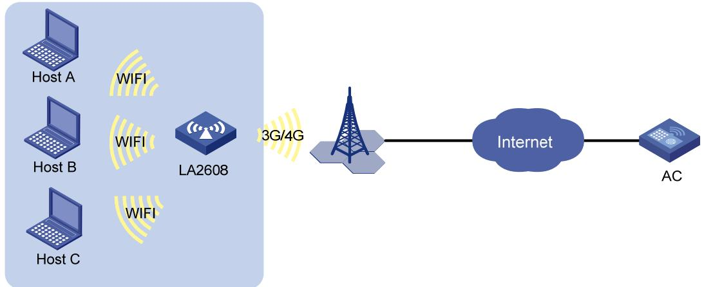

H3C LA2608 室内无线网关

用户手册

Copyright © 2014 杭州华三通信技术有限公司及其许可者 版权所有，保留一切权利。

未经本公司书面许可，任何单位和个人不得擅自摘抄、复制本书内容的部分或全部，并不得以任何形式传播。

H3C、 、Aolynk、 、H<sup>3</sup>Care、 、TOP G、 TOPG IRF、NetPilot、Neocean、NeoVTL、SecPro、SecPoint、SecEngine、SecPath、Comware、Secware、Storware、NQA、VVG、V<sup>2</sup>G、V<sup>n</sup>G、PSPT、XGbus、N-Bus、TiGem、InnoVision、HUASAN、华三均为杭州华三通信技术有限公司的商标。对于本手册中出现的其它公司的商标、产品标识及商品名称，由各自权利人拥有。

由于产品版本升级或其他原因，本手册内容有可能变更。H3C保留在没有任何通知或者提示的情况下对本手册的内容进行修改的权利。本手册仅作为使用指导，H3C尽全力在本手册中提供准确的信息，但是 H3C 并不确保手册内容完全没有错误，本手册中的所有陈述、信息和建议也不构成任何明示或暗示的担保。

## 目 录

1 H3C LA2608 室内无线网关用户手册 ····· ·······································································  
1.1 概述 ········· ··································································································· 1  
1.2 配置LA2608 与无线控制器互通 ············································································································ 1  
1.2.1 配置LA2608 ········· ··········································································································· 1  
1.2.2 配置运营商无线控制器 ·············································································································· 2  
1.2.3 验证LA2608 与无线控制器是否连通 ·························································································· 3

## 1 H3C LA2608 室内无线网关用户手册

## 1.1 概述

H3C LA2608-GM/GU 室内无线网关（以下简称 LA2608）可以为用户提供无线服务，为了实现对设备的管理，LA2608需要通过 3G/4G网络连接到运营商无线控制器。


说明

目前，LA2608只支持与 H3C公司的无线控制器互通。

## 1.2 配置LA2608与无线控制器互通

如 图 1 所示，LA2608 安装了SIM卡，通过 3G/4G网络连接到运营商无线控制器，并向用户提供无线服务。关于LA2608的安装方法，请参见“H3C LA2608室内无线网关 快速安装指南”。

图1 配置 LA2608与无线控制器互通



## 1.2.1 配置LA2608

(1) 配置拨号访问组的拨号控制列表

<LA2608>system-view  
[LA2608]dialer-rule 1 ip permit  
(2) 配置 DCC 拨号


dialer number命令用来配置发起呼叫的拨号串，不同运营商的拨号串不同，请用户在配置前向网络运营商获取发起呼叫的拨号串。

[LA2608]interface Cellular-Ethernet2/0   
[LA2608-Cellular-Ethernet2/0]ip address cellular-allocated   
[LA2608-Cellular-Ethernet2/0]dialer enable-circular   
[LA2608-Cellular-Ethernet2/0]dialer-group 1   
[LA2608-Cellular-Ethernet2/0]dialer timer idle 0

[LA2608-Cellular-Ethernet2/0]dialer timer autodial 5   
[LA2608-Cellular-Ethernet2/0]dialer number \*99# autodial   
[LA2608-Cellular-Ethernet2/0]nat outbound   
[LA2608-Cellular-Ethernet2/0]quit   
(3) 配置 DNS 解析功能   
[LA2608]dns resolve   
(4) 配置静态路由   
[LA2608]ip route-static 0.0.0.0 0.0.0.0 Cellular-Ethernet2/0   
(5) 指定运营商无线控制器的 IP地址   
[LA2608] wlan ac ip 60.191.99.143

## 1.2.2 配置运营商无线控制器


## 说明

如下配置仅供参考，运营商可根据实际情况进行调整。

## (1) 创建业务 VLAN (1) 创建业务 VLAN

<AC>system-view  
[AC]vlan 2  
[AC-vlan2] quit  
(2) 创建 WLAN-ESS 接口并加入业务 VLAN  
[AC]interface WLAN-ESS 1  
[AC-WLAN-ESS1]port access vlan 2  
[AC-WLAN-ESS1]quit  
(3) 配置明文方式的服务模板  
[AC]wlan service-template 1 clear  
[AC-wlan-st-1]ssid ssidh3c  
[AC-wlan-st-1]bind WLAN-ESS 1  
[AC-wlan-st-1]service-template enable  
Please wait... Done.  
[AC-wlan-st-1]quit  
(4) 开启自动 AP 功能  
[AC]wlan auto-ap enable  
[AC]wlan ap 2608 model LA2608 id 1  
[AC-wlan-ap-2608]serial-id auto  
[AC-wlan-ap-2608]radio 1  
[AC-wlan-ap-2608-radio-1]service-template 1  
[AC-wlan-ap-2608-radio-1]radio enable  
[AC-wlan-ap-2608-radio-1]quit  
[AC-wlan-ap-2608]quit  
(5) 配置 VLAN 接口 IP 地址  
[AC]interface Vlan-interface 1  
[AC-Vlan-interface1]ip address 60.191.99.143 255.255.0.0  
[AC-Vlan-interface1]quit  
[AC]interface Vlan-interface 2  
[AC-Vlan-interface2]ip address 10.249.136.1 255.255.252.0  
[AC-Vlan-interface2]quit  
(6) 使能 DHCP 服务，配置 DHCP 地址池

```ini
[AC]dhcp enable
[AC]dhcp server ip-pool vlan2
[AC-dhcp-pool-vlan1]network 10.249.136.0 22
[AC-dhcp-pool-vlan1]gateway-list 10.249.136.1
[AC-dhcp-pool-vlan1]dns-list 218.201.96.130
[AC-dhcp-pool-vlan1]quit
```

## 1.2.3 验证LA2608 与无线控制器是否连通

在无线控制器上执行 display wlan ap 命令，state 字段显示为“R/M”，表示 LA2608 与无线控制器之间已经建立连接。

<Sysname> display wlan ap all   
Total Number of APs configured : 1   
Total Number of configured APs connected : 1   
Total Number of auto APs connected : 0   
AP Profiles   
State : I = Idle, J = Join, JA = JoinAck, IL = ImageLoad   
C = Config, R = Run, KU = KeyUpdate, KC = KeyCfm   
M = Master, B = Backup   
AP Name State Model Serial-ID   
ap1 R/M LA2608 036286A054000033